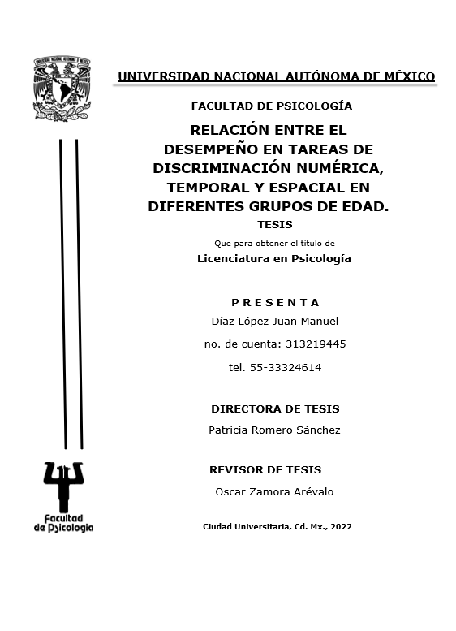

```{r setup, include=FALSE}
knitr::opts_chunk$set(echo = FALSE, warning = FALSE, message = FALSE)
library(vitae)
library(readxl)
library(tibble)
```

```{r, include=FALSE}
# install.packages("readxl") uncomment this if you need to install the package
library(readxl)
readExcelSheets <- function(filename){
  # read all sheets in .xlsx 
  all <- readxl::excel_sheets(filename)
  # import each sheet into a list using readxl::read_excel
  list <- lapply(all, function(x) readxl::read_excel(filename, sheet = x))
  # save sheet name for each sheet (list)
  names(list) <- all
  # breaks up list and creates a dataframe for each sheet with df names matching sheet names
  list2env(list, envir = .GlobalEnv)
}
#Lectura del cv con mi info
filename <- here::here("CV_Díaz_Juan", 
                        "info_cv.xlsx")
readExcelSheets(filename)
```


# Educación

```{r}
`Formación academica` %>% 
    detailed_entries(what = Grado,
                     when = Año,
                     with = Institución,
                     where = Donde,
                     why = Detalles)
```


# Experiencia laboral

```{r}
`Experiencia laboral` %>% 
    detailed_entries(what = Puesto,
                     when = Año,
                     with = Institución,
                     where = Donde,
                     why = Detalles)
```

# Formación complementaria 

```{r}
`Formación complementaria` %>% 
    detailed_entries(what = Logro,
                     when = Año,
                     with = Institución,
                     where = Donde,
                     why = Detalles)
```

# Ponencias
```{r}
`Ponencias` %>% 
    detailed_entries(what = Referencia,
                     when = Año,
                     with = Logro,
                     where = Institución)
```

\newpage

# Anexos

## *Educación*

{width=75, height=75%}

[**LINK**](https://tesiunam.dgb.unam.mx/F/2MNVUNLIDPT5Q7V34YD9J46DL8Y6R9P1SQU2KN9KVMCLKK7PN6-14675?func=find-b&local_base=TES01&request=Relaci%C3%B3n+entre+el+desempe%C3%B1o+en+tareas+de+discriminaci%C3%B3n+num%C3%A9rica%2C+temporal+y+espacial+en+diferentes+grupos+de+edad&find_code=WRD&adjacent=N&filter_code_2=WYR&filter_request_2=&filter_code_3=WYR&filter_request_3=){style="color:blue"}


\newpage

## *Formación complementaría*

{width=75, height=75%}

{width=75, height=75%}

{width=75, height=75%}

{width=75, height=75%}

{width=75, height=75%}
\newpage


## *Ponencias*

{width=75, height=75%}

{width=75, height=75%}

{width=75, height=75%}